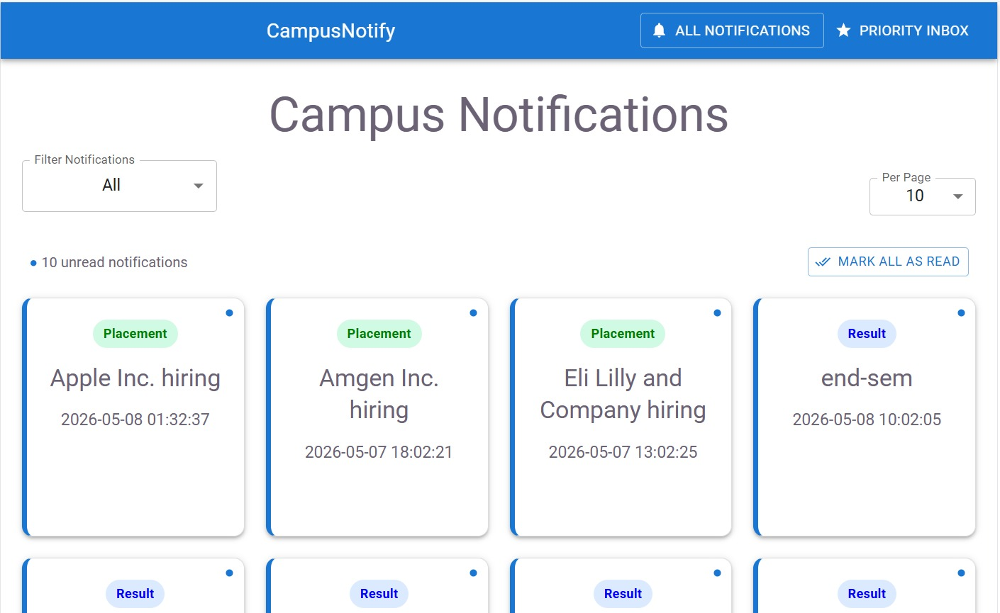
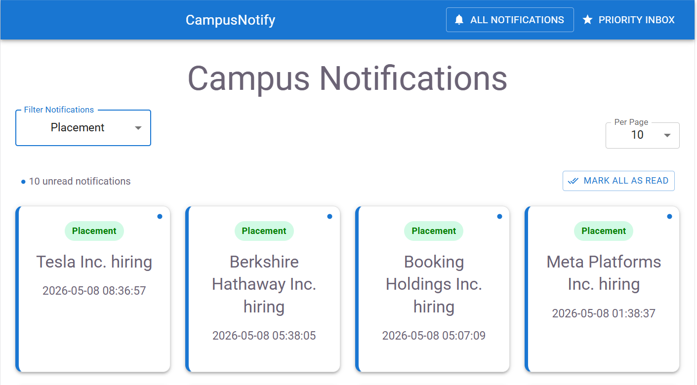
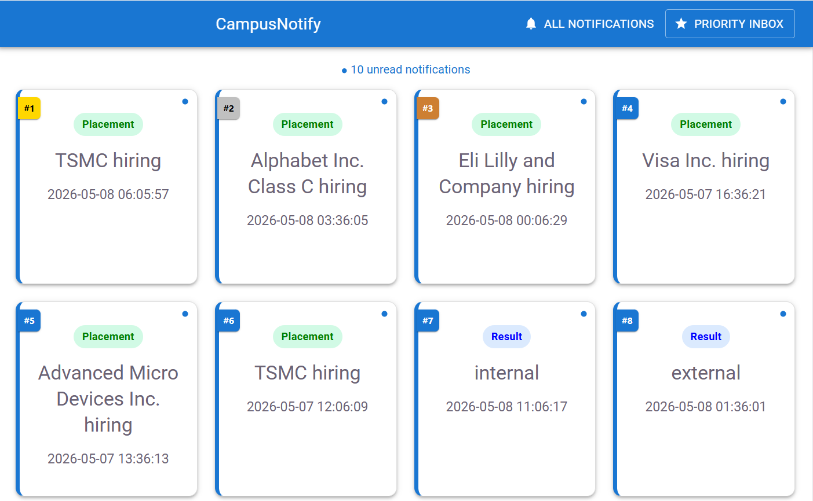

# Campus Notifications Microservice

A responsive React + Vite application built for the Campus Notifications Microservice assessment.

This project implements:

- All Notifications Dashboard
- Priority Inbox
- Notification Prioritization Logic
- Pagination
- Filtering
- Read / Unread Tracking
- Responsive UI using Material UI

---

# Features

## Stage 1

- Fetch notifications from protected API
- Priority sorting logic:
  - Placement > Result > Event
- Recency-based ranking
- Top N notifications
- Notification system design document

## Stage 2

- Responsive React frontend
- Material UI implementation
- Notification cards
- Pagination
- Filters
- Loading states
- Error handling
- Read / unread state
- Mobile responsive design

---

# Tech Stack

- React
- Vite
- Material UI
- JavaScript
- React Router DOM

---

# Project Structure

```bash
src/
│
├── components/
│   ├── FilterBar.jsx
│   ├── Navbar.jsx
│
├── pages/
│   ├── NotificationsPage.jsx
│   └── PriorityPage.jsx
│
├── services/
│   └── api.js
│
├── App.jsx
├── main.jsx
└── index.css
```

---

# Priority Logic

Notifications are prioritized using:

| Type      | Weight |
| --------- | ------ |
| Placement | 3      |
| Result    | 2      |
| Event     | 1      |

Within the same type, newer notifications are ranked higher.

---

# Screenshots

## All Notifications Page



---

## Filters



---

## Priority Inbox



---

# Installation

Clone the repository:

```bash
git clone <your-repository-url>
```

Install dependencies:

```bash
npm install
```

Run development server:

```bash
npm run dev
```

---

# Environment Variables

Create a `.env` file:

```env
VITE_ACCESS_TOKEN=your_access_token
```

---

# API Used

```
http://4.224.186.213/evaluation-service/notifications
```

---

# Responsive Design

The application is fully responsive and optimized for:

- Desktop
- Tablet
- Mobile devices

---

# Author

Vishuddhi Jain
